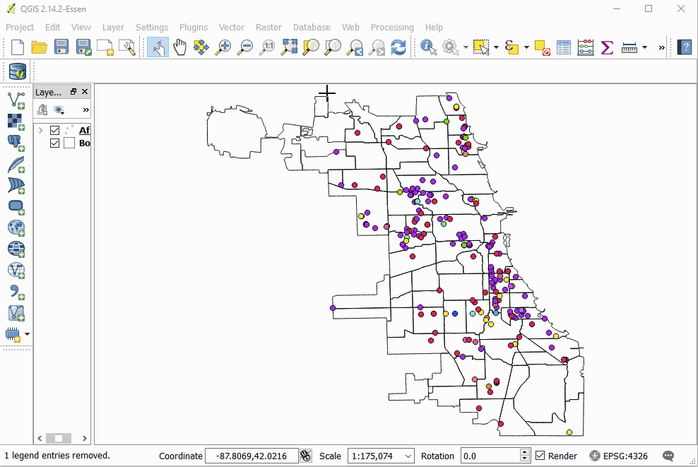

# Selecting and Modifying Data

## Selecting Data by 'Hand'

ESPG etc
## Select by Expression
Intersections, etc

### Modifying Attribute Data

Everything in it's right place

## Geoprocessing!

Buffer
Union

## Joining Data By Attribute
### Using Layer Properties

### Using the Toolbox

## Joining Data By Location (Spatial Join)

