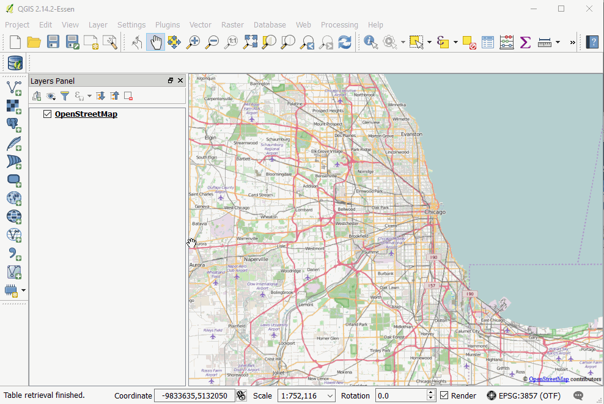
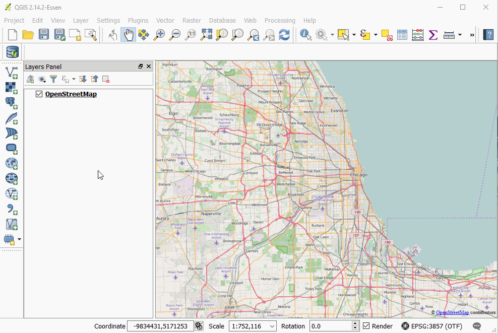

# Loading from Databases

## Database Connections
Accessing data stored in a relational database works a bit differently than loading a flat file.

You must create a connection to the database.

Once that connection is established you can load, query, and modify that data directly, using QGIS as an interface.

## Postgres with PostGIS

### Working with Postgres

Postgres is a popular open source relational database system.

PostGIS is an extension for Postgres that adds geospatial data types to any Postgres database, along with a suite of powerful geosptial tools.

### Making a Connection

We point to our template, port, username and password

The outcome is that we have established a connection and can access the information here (although we only have a template schema so far, and not data!)

### Perks & Pitfalls of being connected

Now, when we save layers, we can save it directly to our DB.

E.g., reproject a layer, choose to save it to a database, select the schema and pick a name...

Within PostGIS we have the ability to index geometries for our layers which speeds recall and query for spatial operations, as compared to a flat file

When opening a totally new project, the PostGIS connect will persist, and can even bring in its tables

One consideration though is permissions, where we may or may not want to allow users to make changes to centrally-accessible

### Loading data from a Database connection

## From the sidebar

## Using the QGIS DB Manager

The DB Manager has a bunch of useful features, it allows you to browse and preview data before adding it to the canvas and has a decent system for writing and saving SQL queries. 

### Query Example

Can use PostGIS scripting for queries, e.g. "SELECT ST_BUFFER(ST_TRANSFORM("geom", 3435), 300) FROM potholes"

* This command reprojects the data, then creates a buffer. Here, we don't need to create something for each intermediate step. In effect, QGIS can then just become a viewer rather than a tool.

* Could also add CREATE TABLE buffer AS (.) around the above to create a new table. Just need to refresh the connection for this to reappear.

* Or, could add SELECT * FROM someothertable WHERE someothertable.geom INTERSECTS (.) to use the buffer as a subquery to an operation that identifies the intersection

* Operations are remarkably fast

* There are ways to install query builder plugins in QGIS to write queries here rather than having to jump out of QGIS and back into PostGIS

## SpatialLite

Spatiallite is a similar setup to Posgres/PostGIS, but it's built of SQLite. Its small and lightweight, with the entire database being stored as a single file.

It can do many of the similar geospatial queries as PostGIS, but in general is not as performant.

## GeoPackage

What is GeoPackage? It's a version of SpatialLite customized. Smaller, maybe faster? Not sure why people aren't using these widely yet but no reason not to.
