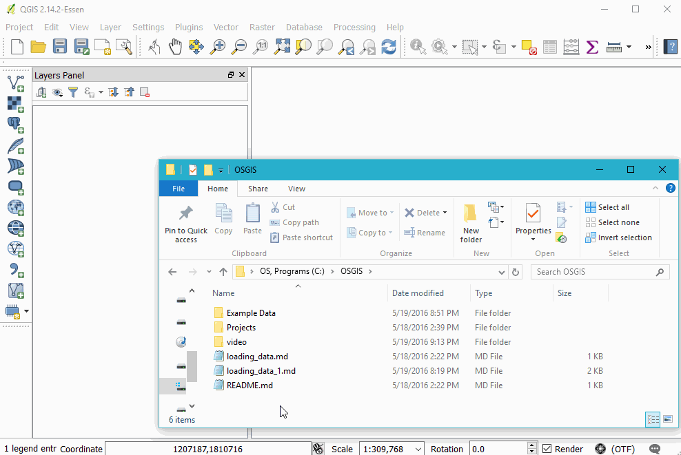

# Loading Vector Data

## Loading CSV (and other delineated data)

The big comma icon represents delimited (e.g. "comma" delimited or csv) files

The "create layer" window has a number of format-specific options, such as indicating what delimiter is used, allows users to skip a given number of rows, and indicate geometric information present in the table. Our case, QGIS automatically found our Latitude and Longitude columns and suggested them to be used to create our geometric data for this layer.

If you are loading in data that has no inherent geometry, simply select the 'No geometry' option.

## Watch a file
If you choose to watch the file, QGIS will automatically update the data in the layer if the csv file is modified.

## Excel(xlsx)
Qgis can handle xls and xlsx files, but plays much nicer with the newer xlsx format.
### Click and drag from OS browser

### Create geometry from columns

## Shapefiles

Shapefiles are a ubiquitous, yet antiquated  geospatial file format. Despite their many limitations and the annoying problems they present, you will likely still come across them.

### Drag and Drop

### Add Vector Layer button

### Create Spatial Index

## GeoJSON

GeoJSON is a widely geospatial data format, most prevalent in web development. It allows for a human and machine-readable exchange of data. These files are often larger than other formats and cannot be directly edited by QGIS, but they are very convenient otherwise.

