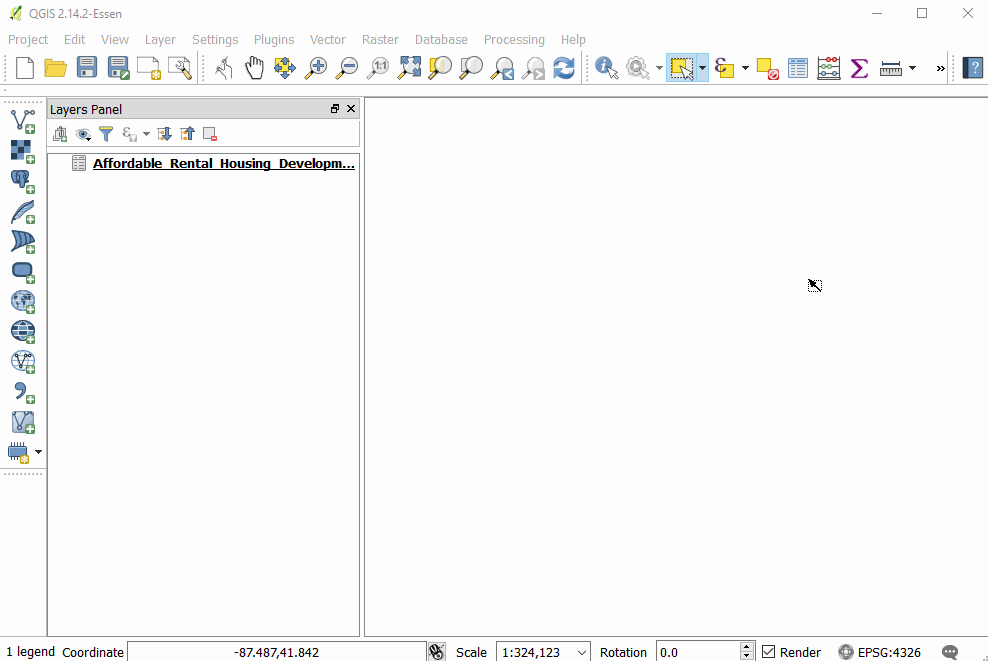

# Loading Vector Data

## Loading CSV (and other delineated data)

Adding in delimited data

The big comma represents delimited (e.g. "comma" delimited or csv) files

The "create layer" window has a number of format-specific options, such as indicating what delimiter is used, allows users to skip a given number of rows, indicate geometric information present in the table (e.g. auto-detecting
latitude and longitude)

## Watch a file
Clicking on "Watch file" -- e.g. if you have the file open in another
window, QGIS will automatically update the version

## Excel(xlsx)

## Click and drag from OS browser

## Create geometry from columns

## Shape Files

## Drag and Drop

## Add Vector Layer button

## Create Spatial Index

## GeoJSON

